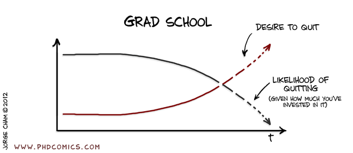
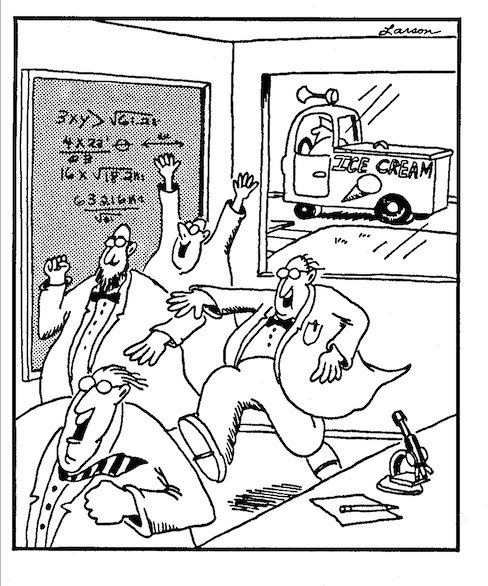

# R Markdown

You can use R markdown to create presentations. It's easy to convert your markdown document to HTML, PDF, or MS Word documents as needed. For more details on using R Markdown see <http://rmarkdown.rstudio.com>.

## R Markdown Basics | Slide with Bullets {.columns-2}

 - Bullet 1
 - Bullet 2
 - Bullet 3


Make a separate column by just adding a line break between the lines.
You can add more bullets if you want.

 - Customize as you like!
 - You can show code as well `here's some code y=mx+b`
 - Or show equations $\beta$*~2~ x~i~^2^*, $\beta$*~3~ x~i~^3^*, etc.
 - $M$*~1~* : $Y$*~i~* ~ $Normal$ ($\mu$, $\sigma$) 


## Slide with Bullets & Indents {.build}

The markdown code looks like this:
```

 > Block of text with a caret  
 
  ```
  Or you can use three ticks to set apart a block of code
  ```

```

 > Block of text with a caret
 
 ```
 Or you can use three ticks to set apart a block of code
 ```

## Slide with Plot | This is really exciting

```{r, echo=FALSE}
plot(cars,pch=21,bg="skyblue",main="a super exciting plot")
```

## Now on to embedding *SHINY* into Slides/HTML

 - **HTML** Create a stand-alone html file which retains the dynamic interactive nature of shiny apps, in long document format.

 - **SLIDES** You can also create a dynamic slide presentation, but you are restrained by how much content you can fit on a single slide.

 - *Random figure for comic levity...*



## Shiny Examples | Interactive Selections

```{r, echo=FALSE, warning=FALSE, message=FALSE}

# make interactive plots
library(shiny);library(htmlwidgets); 
library(ggplot2); library(scales); library(dplyr)
library(readr); library(lubridate)
library(DT)

# get data
load(file = "NFA_merged.RData")

# shiny app here:
shinyApp(
  ui <- fluidPage(
    
    # Some custom CSS for a smaller font for preformatted text
    tags$head(
      tags$style(HTML("
                    pre, table.table {
                    font-size: smaller;
                    }
                    "))
    ),
    
    fluidRow(
      column(width = 3, 
             wellPanel(
               selectInput("wateryr", label = "Water Year",
                           choices=c(2011,2012,2013), selected = 2011),
               verbatimTextOutput("info")
             )),
      
      column(width = 9, class="well",
             h4("Plot of Flow (cfs)"),
             fluidRow(
               column(width=5,
                      # In plotOutput, passing values for 
                      # click, dblclick, hover, or brush
                      # will enable those interactions.
                      plotOutput("plot1", height = 400,
                                 # Equivalent to: 
                                 #click = clickOpts(id = "plot_click")
                                 click = "plot_click",
                                 hover = hoverOpts("plot_hover"),
                                 brush = brushOpts(
                                   id = "plot_brush",
                                   resetOnNew = TRUE
                                 )
                      )
               ),
               column(width=4,
                      plotOutput("plot2", height = 400,
                                 click = "plot_click2",
                                 hover = hoverOpts("plot_hover2"),
                                 brush = brushOpts(
                                   id = "plot_brush2",
                                   resetOnNew = TRUE
                                 )
                      )
               )
             )
      )
    ),
    br(),
    fluidRow(
      column(width = 6, 
             dataTableOutput("plot_brushed_points")
      )
    )
  ),
  
  server <- function(input, output) {
    
    df<-reactive({
      filter(nfa_dd, wtr_yr==input$wateryr | 
               year(Date)==input$wateryr & month>9)
    })
    
    ranges <- reactiveValues(x=NULL, y=NULL)
    
    # string output
    output$info<- renderText({
      xy_str<-function(e) {
        if(is.null(e)) return("NULL\n")
        paste0("\n"," Date =",floor_date(as.POSIXct(e$x, tz="",origin="1970-01-01"),"day"), "\n",
               " Flow =", round(e$y, 1),"\n")
      }
      
      xy_range_str<-function(e){
        if(is.null(e)) return ("NULL\n")
        paste0("\n",
               " xmin =",floor_date(as.POSIXct(e$xmin, tz="",origin="1970-01-01"),"day"),"\n",
               " xmax =",floor_date(as.POSIXct(e$xmax, tz="",origin="1970-01-01"),"day"),"\n",
               " duration =", round(interval(as.POSIXct(e$xmin, tz="", origin="1970-01-01"),
                                             as.POSIXct(e$xmax, tz="",
                                                        origin="1970-01-01"))/edays(),1),"\n",
               " ymin =",round(e$ymin,1), "\n",
               " ymax =",round(e$ymax,1))
      }
      
      paste0(
        "click: ", xy_str(input$plot_click2),
        "hover: ", xy_str(input$plot_hover2),
        "brush: ", xy_range_str(input$plot_brush2)
      )
    })
    
    # left plot
    output$plot1 <- renderPlot({
      ggplot(data=df(), aes(x=Date, y=cfs)) + 
        geom_line(color="navyblue") + theme_bw() + xlab("")+
        theme(axis.text.x = element_text(angle = 45, hjust = 1))+
        scale_x_datetime(breaks=date_breaks("1 months"),labels = date_format("%b-%y"))
    })
    
    # right plot (zoomed)
    output$plot2 <- renderPlot({
      ggplot(data=df(), aes(x=Date, y=cfs)) + 
        geom_line(color="red3", size=0.8) + theme_bw() + xlab("") +
        theme(axis.text.x = element_text(angle = 45, hjust = 1))+
        coord_cartesian(xlim =  ranges$x, ylim=ranges$y) 
    })
    
    # this section takes selected region & passes to the zoom plot
    observe({
      brush <- input$plot_brush
      if (!is.null(brush)) {
        ranges$x <- c(as.POSIXct(brush$xmin, tz="",origin="1970-01-01"), as.POSIXct(brush$xmax,tz="",origin="1970-01-01"))
        ranges$y <- c(brush$ymin, brush$ymax)
        
      } else {
        ranges$x <- NULL
        ranges$y <- NULL
      }
    })
    
    
    # this is the data output of the selected region
    output$plot_brushed_points <- renderDataTable({
      dat <- df()
      # With base graphics, we need to explicitly tell it which variables were
      # used; with ggplot2, we don't.
      # res <- brushedPoints(dat, input$plot_brush, xvar(), yvar())
      res <- brushedPoints(dat, input$plot_brush)
      datatable(res,caption = "Recession Hydrometrics (left)",style = "bootstrap", rownames = F)
    })
    
    # this is the data output of the selected region
    output$plot_brushed_points2 <- renderDataTable({
      dat2 <- df()
      res2 <- brushedPoints(dat2, input$plot_brush2)
      df2<- res2 %>% 
        group_by(site) %>% 
        filter(wtr_yr==2011,Date > as.POSIXct("2011-06-01")) %>%
        summarize("Rcsn_avg_daily_rate" = mean(((lag(cfs)-cfs)/cfs)*100,na.rm=TRUE),
                  "Rcsn_duration" = interval(min(Date),max(Date))/edays(),
                  "low_flow_start" = floor_date(max(Date)),
                  "rcsn_stg_ratio" = mean(max(stage,na.rm=T)/min(stage,na.rm=T)),
                  "rcsn_stg_CV" = mean(sd(stage,na.rm=T)/mean(stage,na.rm=T))) %>% as.data.frame()
      
      datatable(df2, caption = "Zoomed Hydrometrics (right)",filter = c("none"), selection="none", style = "bootstrap", rownames = F)
    })
  }
)
    
```

## Shiny Examples | Leaflet Polygon Map

```{r, echo=F,  warning=FALSE, message=FALSE}

# polygon map
library(leaflet)
library(maps)
mapStates = map("state", fill = TRUE, plot = FALSE)
leaflet(data = mapStates) %>% addTiles() %>%
  addPolygons(fillColor = topo.colors(10, alpha = NULL), stroke = FALSE)

```

## Shiny Examples | Leaflet: Add Points/Polys to Map

```{r echo=F}

library(leaflet)

(m <- leaflet() %>% addTiles() %>% 
  setView(-120.9, 39, 11) %>% # map location
  addMarkers(-120.94293, 38.93403) %>% # American Canyon
  addMarkers(-120.90732, 39.05716) %>% # Indian
  addPopups(-120.93, 38.92, popup = "Fuzzy-toed Snifflers seen here!") %>% # add popup
  # add some random circles:
  addCircles(color = "black", 
             runif(90, -120.9, -120.8), 
             runif(90, 39, 39.1), runif(90, 10, 500))
)
```

## Shiny Examples: Temperature Data

```{r echo=FALSE, warning=FALSE, message=FALSE}

library(shiny)

load("watertemp_dy_2011-2013.RData")
shinyApp(
  ui = fluidPage(
    h3("Water Temperature Metrics for Recession Sites 2011-2013"),
    inputPanel(
      selectInput("var", label="variable:",
                  choices=c("temp.avg","temp.min","temp.max","temp.CV",
                            "temp.7.avg","temp.7.min","temp.7.max","temp.7.CV",
                            "temp.30.avg","temp.30.min","temp.30.max","temp.30.CV")),
      selectInput("yr", label="year:", choices=c(2011,2012,2013)),
      checkboxInput("facets",label="Facet by site?", value=FALSE)
    ),
    plotOutput("tempPlot")
  ),
  
  server = function(input, output) {

    output$tempPlot<-renderPlot({
      
      df<-reactive({df.dy[df.dy$year==input$yr & df.dy$yday > 100
                          & df.dy$yday<300,]})
      palette<-c("dark blue","blue","light blue","green","yellow","orange","orangered","brown4")
      breaks<-seq(0,32,4) # for color scale

      if(input$facets){
        print(ggplot() + 
        geom_line(data=df(),
                       aes_string(x="date", y=input$var, col=input$var),size=1)+
          scale_colour_gradientn("Water \nTemp (C)",colours=palette(palette), values=breaks, 
                                 rescaler = function(x, ...) x, oob = identity,limits=range(breaks), 
                                 breaks=breaks, space="Lab") +
          scale_y_continuous(limits=range(breaks), breaks=breaks)+
          ggtitle(paste0(input$var, ": of Water Temperature (C)"))+
          theme_bw() + facet_grid(.~site))
      } else(
        print(ggplot() + 
                geom_line(data=df(),
                          aes_string(x="date", y=input$var, col="site"),size=1) +
                theme_bw())
      )
    })
  },
  options = list(height = 700)
)

```

## Make double columns & *Add pictures* {.columns-2}

 - Let's add some text and see how this looks. You can play around with the **style**, *more style*, and even<div class ="blue3">colors!</div>
 - or add some pictures
 - just make sure to add a break line between left and right cols  


 *A lazy fox...*

## Some Shiny Examples & Resources {.smaller}

#### Help/Tutorials  

 - *Tutorials/Help:* http://shiny.rstudio.com
 - *RMarkdown Cheatsheet:* http://shiny.rstudio.com/articles/rm-cheatsheet.html
 - *Shiny Cheatsheet:* http://shiny.rstudio.com/images/shiny-cheatsheet.pdf
 - *Layout Overview:* http://shiny.rstudio.com/articles/layout-guide.html

#### Shiny Examples  

 - https://gallery.shinyapps.io/106-plot-interaction-exclude/
 - http://www.showmeshiny.com/
 - http://shiny.snap.uaf.edu/cc4liteFinal/
 - http://shiny.snap.uaf.edu/temp_wind_events/
 - http://shiny.snap.uaf.edu/ak_daily_precipitation/
 - http://blackspot.org.uk/
 
## {.columns-2}

**Thanks! Have More Questions?**

 - Seek RStudio or ShinyApps help, they do have great resource pages
 - Ping the Davis R Users Group
 - Email me *rapeek at ucdavis dot edu*

 
 
 
